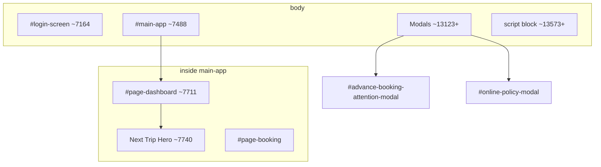
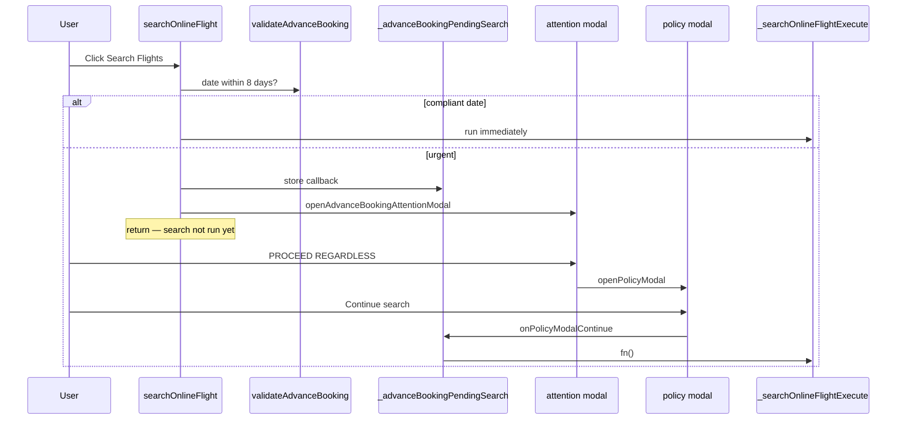

# Advance Booking & Policy Modal — Dependency Analysis

This document explains why removing `#advance-booking-attention-modal` and `#online-policy-modal` from [index.html](index.html) can appear to break unrelated UI (Hero section, CTAs), and how to remove them safely.

**Stack note:** This app is a single **vanilla HTML** file with global `window.*` helpers — not React/JSX. There is no React state tied to these modal nodes.

---

## Executive Summary

| Question | Answer |
|----------|--------|
| Do modals structurally wrap the Hero or dashboard grid? | **No** — they are `position: fixed` overlays at the end of `<body>`, outside `#main-app`. |
| Is layout broken by `flex-direction: column-reverse` or `order-*` on the itinerary/dashboard card? | **No** — those patterns are not applied to the Hero or these modals. |
| Are primary CTAs chained through modal confirm buttons? | **Yes, for online flight/rail search** when the departure date is fewer than 8 days out. |
| Does deleting modal DOM remove layout state? | **No** — state is `window._advanceBookingPendingSearch` (JavaScript), not DOM-driven height flags. |

If **Hero layout** and **many** buttons fail after deletion, suspect **accidental HTML corruption** near the end of `index.html` (modals sit immediately before `<script>`), or a **leftover `fixed inset-0` overlay** without `hidden`.

---

## DOM Architecture



**Important:** `#advance-booking-attention-modal` and `#online-policy-modal` use **IDs**, not classes. Selectors like `.advance-booking-attention-modal` will not match unless you add that class yourself.

| Region | Approx. lines | Relationship to modals |
|--------|---------------|------------------------|
| Login hero | `#login-screen` ~7164 | Independent |
| Dashboard Hero | `#page-dashboard` ~7740 | Inside `#main-app`; independent |
| Advance/policy modals | ~13474–13512 | **After** `#main-app` closes (~13121) |
| Online search UI | `#page-booking` | Uses modals via JS gate only |

---

## 1. Event Chaining — Search CTAs (Real Functional Dependency)

### Flow

When the user clicks **Search Flights** or **Search Rail** with a date **within 8 days**, execution stops at the attention modal. The actual search runs only after **Continue search** on the policy modal.



### Key code locations

| Purpose | Function / element | Approx. lines |
|---------|-------------------|---------------|
| Pending callback storage | `window._advanceBookingPendingSearch` | ~13610 |
| 8-day rule | `window.validateAdvanceBooking` | ~13612–13628 |
| Open attention modal | `window.openAdvanceBookingAttentionModal` | ~13630–13633 |
| Proceed → policy | `window.onAdvanceBookingProceedRegardless` | ~13651–13654 |
| **Runs stored search** | `window.onPolicyModalContinue` | ~13672–13677 |
| Flight search gate | `window.searchOnlineFlight` | ~21973–22022 |
| Rail search gate | `window.searchOnlineRail` | ~20316–20350 |
| Actual flight search | `window._searchOnlineFlightExecute` | ~21833+ |
| Actual rail search | `window._searchOnlineRailExecute` | ~20300+ |

### Policy modal is the only executor

```javascript
window.onPolicyModalContinue = () => {
    window.closePolicyModal();
    const fn = window._advanceBookingPendingSearch;
    window._advanceBookingPendingSearch = null;
    if (typeof fn === 'function') fn();
};
```

### Flight search gate (example)

```javascript
if (!window.validateAdvanceBooking(dd)) {
    window._advanceBookingPendingSearch = () => window._searchOnlineFlightExecute();
    window.openAdvanceBookingAttentionModal();
    return;
}
window._searchOnlineFlightExecute();
```

### If you delete the modals without refactoring

- `openAdvanceBookingAttentionModal()` becomes a no-op (`getElementById(...)?.classList.remove` with optional chaining).
- User sees no dialog; `_advanceBookingPendingSearch` is never invoked.
- **Search Flights / Search Rail** appear broken for urgent dates only.

### Not affected by this chain

- Dashboard Hero “View Itinerary” (~7756)
- “New Travel Request” / `window.startBooking` (~7719)
- Login `window.handleLogin` (~15218)
- Booking Online/Offline `window.switchTab`
- Most sidebar navigation via `window.showPage`

---

## 2. Structural DOM Nesting — Not a Layout Parent

Modals are **not** flex/grid parents of Hero or CTAs.

```html
<div id="advance-booking-attention-modal"
     class="hidden fixed inset-0 z-[210] flex items-center justify-center ...">
```

- `position: fixed` + `inset-0` → removed from normal document flow.
- `hidden` by default → no layout footprint when idle.
- Placed after `#main-app` closes, alongside other global modals (`#confirm-modal`, `#fee-notice-modal`, etc.).

Deleting them should **not** shift Hero alignment if the rest of the HTML remains valid.

---

## 3. State / Layout Flags — JavaScript Only

| Mechanism | Type | Removed when modal HTML deleted? |
|-----------|------|--------------------------------|
| `window._advanceBookingPendingSearch` | JS variable | **No** — still exists |
| Modal `hidden` class | DOM | Yes — but open/close use `?.` and fail silently |
| Hero height / grid calculations | CSS on `#page-dashboard` | **Unrelated** to these modals |

There is no React rendering condition that measures modal height for the Hero block.

---

## Why Hero + CTAs Might Still “Break” After Deletion

If **layout** shifts and **many** buttons fail (not only urgent-date search):

### 1. Accidental HTML corruption

Modals sit at ~13472–13512, immediately before `<script>` (~13573). Deleting the wrong `</div>` or part of the script tag can break parsing and **all** `onclick="window...."` handlers.

**Check:** DevTools → Console for syntax errors; validate `#main-app` / `#page-dashboard` nesting.

### 2. Leftover invisible overlay

If a `fixed inset-0` element remains **without** `hidden`, it blocks clicks app-wide.

### 3. Wrong deletion target

Broad “modal” cleanup might remove `#confirm-modal` (~13124) or content inside `#main-app`.

### 4. Wrong selector

Using class `.advance-booking-attention-modal` when only **id** `advance-booking-attention-modal` exists in markup.

---

## Option A2 — Itinerary Layout (Separate Issue)

The Booking Offline toggle appearing **below** search UI was caused by **DOM order**, not modal CSS:

- **Option A** placed `#content-offline` in the gray header; `rehomeOnlineBookingUi` moved the full `#online-booking-ui-root` there, above the toggle in the white body.
- **Option A2** places `#content-offline` in `.p-4.sm:p-6` **after** `#itinerary-tab-container-wrap` and **before** `#content-online`, matching Online flow.

See current structure ~9380–9410 in `index.html`.

---

## Safe Removal Plan (Unzip Handlers)

**Do not delete modal DOM first.** Refactor the gate, then remove markup.

### Step 1 — Centralize the gate

```javascript
window.runAdvanceBookingGatedSearch = (dateIso, executeFn) => {
    if (window.validateAdvanceBooking(dateIso)) {
        executeFn();
        return;
    }
    // Choose one product behavior:
    // A) Auto-proceed (no modal)
    // executeFn();

    // B) Reuse existing #confirm-modal (~13124)
    window.showConfirm(
        'Urgent booking is out of policy. Continue?',
        executeFn
    );
};
```

### Step 2 — Update entry points

Replace duplicated gate blocks in:

- `window.searchOnlineFlight` (~21991–22020)
- `window.searchOnlineRail` (~20319–20348)

### Step 3 — Remove unused helpers

After nothing calls them:

- `openAdvanceBookingAttentionModal`, `closeAdvanceBookingAttentionModal`, `dismissAdvanceBookingAttentionModal`
- `onAdvanceBookingGoBack`, `onAdvanceBookingProceedRegardless`
- `openPolicyModal`, `closePolicyModal`, `onPolicyModalDismiss`, `onPolicyModalContinue`

(~13630–13677)

### Step 4 — Delete modal HTML

Remove ~13472–13512 only after Steps 1–3. Keep `#confirm-modal` if you use `showConfirm`.

---

## Blocks to Treat as One Unit

| Block | Approx. lines | Role |
|-------|---------------|------|
| `#advance-booking-attention-modal` | 13474–13492 | Step 1 — policy warning UI |
| `#online-policy-modal` | 13494–13512 | Step 2 — **executes** pending search |
| Gate helpers | 13608–13677 | Orchestration |
| `searchOnlineFlight` gate | 21991–22020 | Flight entry |
| `searchOnlineRail` gate | 20319–20348 | Rail entry |
| `_searchOnlineFlightExecute` | ~21833+ | Actual flight search |
| `_searchOnlineRailExecute` | ~20300+ | Actual rail search |

**Independent:** Dashboard Hero / CTAs ~7710–7760.

---

## Verification Checklist After Changes

- [ ] Console has no JavaScript parse errors on load.
- [ ] `#main-app` and `#page-dashboard` exist and nest correctly in Elements panel.
- [ ] Login and dashboard CTAs work without opening booking.
- [ ] Search with date **≥ 8 days** out runs immediately.
- [ ] Search with date **< 8 days** follows chosen policy (modal replacement or auto-proceed).
- [ ] No full-screen invisible layer blocking clicks (`fixed inset-0` without `hidden`).
- [ ] Only one `#content-offline` in document (if using Option A2 itinerary layout).

---

## Related Files

| File | Contents |
|------|----------|
| [index.html](index.html) | All markup and `window.*` booking logic |
| [MOBILE_RESPONSIVE_CHANGES.md](MOBILE_RESPONSIVE_CHANGES.md) | Separate mobile layout notes (dashboard, filters) |

---

*Generated for the china-obt-main codebase. Line numbers are approximate and may shift as `index.html` is edited.*
